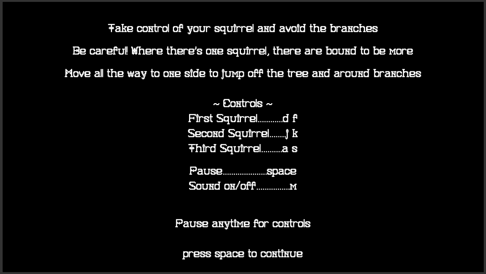
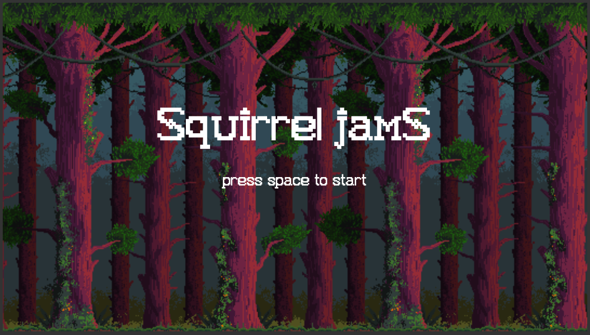

Built using JavaScript and HTML5, Squirrel Jams is an endless runner game in the style of Temple Run and Unicorn Dash. Players take control of up to three squirrels and must help them avoid the branches as they race up towering tree trunks.

[Play Squirrel Jams](https://birbmaaan.github.io/squirreljams/)

## Controls
**1. first squirrel:**
  * left: D
  * right: F
  
**2. second squirrel:**
  * left: J
  * right: K
  
**3. third squirrel:**
  * left: A
  * right: S
  
**4. pause:** space

**5. sound on/off:** M

## Technologies used
1. JavaScript
2. HTML5
3. [BeepBox music maker](http://www.beepbox.co/#)

## Gameplay

1. Upon loading the site, players are greeted with a screen introducing the game and controls.



2. The title screen displays between rounds of gameplay.



3. When gameplay begins, the player starts with a single squirrel, with whom they must avoid hitting tree branches while they run.


4. As the game progresses, up to two more squirrels will appear. The player must control all of the visible squirrels simultaneously. Squirrels can move around tree branches, as well as jump off the sides of the tree trunks.


5. If any of the squirrels hit a tree branch, the game ends and players are returned to the title screen.


6. The pause screen can be accessed at any time during gameplay, and provides a reminder of the controls.


## Challenges

### 1. Animation loop and resetting the game

The biggest challenge in creating this game was making sure the game loop worked smoothly. With so many moving parts, it was a continual process of tweaking variables, clearing various canvases, and resetting values to ensure everything was entirely reset when a player dies and starts again. With the player taking control of up to 3 squirrels, an important consideration was figuring out how to time the appearance of the second and third squirrels. 

The bulk of the game loop logic lives in the animate function within the gameview class. This function checks how many squirrels should be on the screen, as well as which obstacles to generate, move, and remove. 

``` javascript
animate() {
    if (!this.paused && this.playing) {
      if (this.game.detectCollision()) {
        this.gameOver();
      }

      for (let i = 0; i <= 2; i++) {
        if (this.game.squirrels[i].active && this.game.liveObstacles[i]) {
          this.game.addObstacle(i);
        }
      }
      this.game.moveObjects();
      this.game.removeObjects();
      this.game.draw(this.ctx);
      this.drawScore();
      if (this.frames <= 1900) this.checkActives();
      this.frames++;
      requestAnimationFrame(this.animate.bind(this));

    }
  }
```

SetTimeouts were initially used for this, which created the problem of squirrels continuing to appear even if the game was paused. 

In order to ensure the smooth animation of sprites and backgrounds that were locked to actual gameplay, it made the most sense to create an instance variable for tracking frames, incrementing this variable with every requestAnimationFrame and using frame counts as a sort of timer. 

When a player dies, the game loop is reset, with all timers, counters, and booleans reset in preparation for the next game, and the main game canvases cleared.

``` javascript
  restart() {
    this.clearScreen();
    this.clearCache();
    this.boop.stop();
    this.menuMusic.restart();
    this.menu();
  }
```

All of this taken together created a smooth game loop that allows players to easily play the game as many times as they would like.

### 2. Multiple squirrels and trees

Implementing multiple squirrels and trees full of obstacles into the game required keeping track of frame counts in order to have them appear after a certain number of animation frames. 

``` javascript
  checkActives() {
    switch (this.frames) {
      case 570:
        this.game.squirrels[2].active = true;
        break;
      case 1720:
        this.game.squirrels[1].active = true;
        break;
      case 150:
        this.game.liveObstacles[0] = true;
        break
      case 720:
        this.game.liveObstacles[2] = true;
        break;
      case 1870:
        this.game.liveObstacles[1] = true;
      default:
        break;
    }
  }
```

It also required creating arrays containing separate position coordinates for each of the individual squirrels and their respective obstacles, ensuring balanced obstacle generation across all three trees.

``` javascript
  const POSITIONS = {
    farleft: [420, 0, 840],
    left: [545, 125, 965],
    middle: [620, 200, 1040],
    right: [695, 275, 1115],
    farright: [820, 400, 1240],
  }
```

``` javascript
  detectCollision() {
    let dead = false;
    this.squirrels.forEach(squirrel => {
      Object.keys(this.obstacles).forEach(num => {
        this.obstacles[num].forEach(branch => {
          if (this.beenHit(squirrel, branch)) {
            dead = true;
          }
        })
      })
    })
    return dead;
  }
```

By keeping squirrels and their tree branches completely separate from each other, it was easy to ensure there are no extraneous collision checks, and that obstacles are rendered appropriately at the proper times.

## Future features
1. Implement local and global high scores
2. Touch up jump actions
3. Allow player to select number of squirrels
4. Make screen sizing more dynamic
