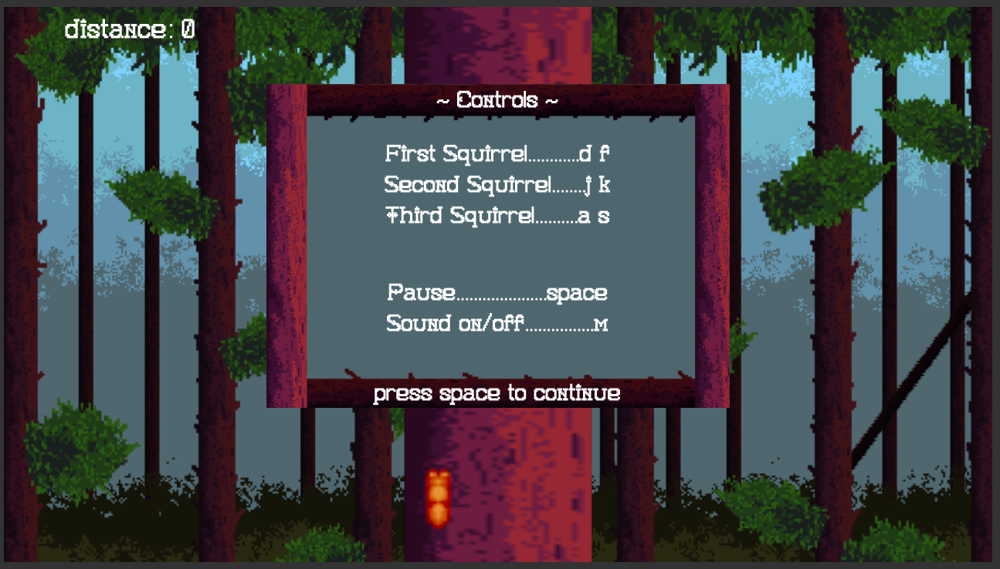

Built using JavaScript and HTML5, Squirrel Jams is an endless runner game in the style of Temple Run and Unicorn Dash. Players take control of up to three squirrels and must help them avoid the branches as they race up towering tree trunks.

[Play Squirrel Jams](https://birbmaaan.github.io/squirreljams/)

## Controls
1. first squirrel:
  * left: D
  * right: F
2. second squirrel:
  * left: J
  * right: K
3. third squirrel:
  * left: A
  * right: S
4. pause: space
5. sound on/off: M

## Technologies used
1. JavaScript
2. HTML5
3. [BeepBox music maker](http://www.beepbox.co/#)

## Gameplay

1. Upon loading the site, players are greeted with a screen introducing the game and controls.

2. The title screen displays between rounds of gameplay.

3. When gameplay begins, the player starts with a single squirrel, who must avoid hitting tree branches as they run.

4. As the game progresses, up to two more squirrels will appear. The player must control all of the visible squirrels simultaneously.

5. If any of the squirrels hit a tree branch, the game ends and players are returned to the title screen.

6. The pause screen can be accessed at any time during gameplay, and provides a reminder of the controls.

## Challenges

### 1. Animation loop and resetting the game

The biggest challenge in creating this game was making sure the game loop worked smoothly. With so many moving parts, it was a continual process of tweaking variables, clearing various canvases, and resetting values to ensure everything was entirely reset when a player dies and starts again. With the player taking control of up to 3 squirrels, an important consideration was figuring out how to time the appearance of the second and third squirrels. After initially using SetTimeouts ran into the issue of 

### 2. Hitboxes and sprite generation

## Future features
1. Implement local and global high scores
2. Touch up jump actions
3. Allow player to select number of squirrels
